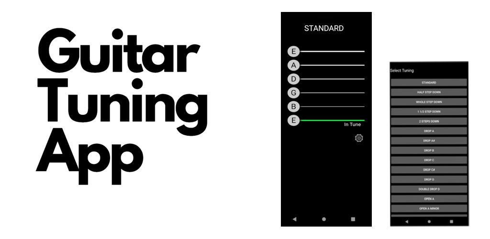

# Features
* Real-time guitar tuning
* Various tunings available

#
# Privacy Policy

> By downloading or using the app, you agree to this privacy policy in its entirety.
> The developers/owners of this app retain the rights to update or amend the policy in anyway, and at anytime.
> This document can be printed for reference by using the print command in the settings of any browser.

## Definitions

**"app"** - StrumKit Guitar Tuner App. \
**"developer"** - The developers of the app. \
**"app owner"** - The owner of the app. \
**"third party"** - Other parties used with the app but not associated to the developer or app owner. \
**"user"** - The user of the app.

## Device permissions

This app requires the following device permissions: 
  1. RECORD_AUDIO 
  2. MODIFY_AUDIO_SETTINGS
  3. INTERNET (for google ads)

Audio is processed on the device and not transimitted beyond the device.

## Protection of data

The developer has taken reasonable steps to protect any data collected by the app.

## Processing of personal data

Audio data captured by the app is done so via the devices microphone (or audio in). All data captured by the apps is used for providing an accurate guitar tuning experience. The app does not interpret, extrapalate or recognize personal identifiable information. The app is only capable of identifying pitch from audio. Any audio is processed by the app then disgarded as soon as deemed possible.

Data is not sold or transferred to any third parties.

## Third parties

This app uses the following third parties:

1. Google Ads
- https://policies.google.com/technologies/partner-sites?hl=en-US

## Owner and Data Controller

guitartuner-data@allen508.co.uk

